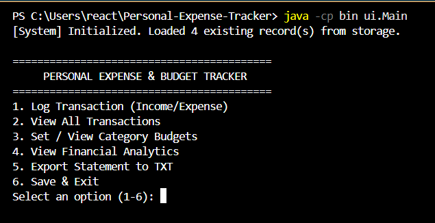
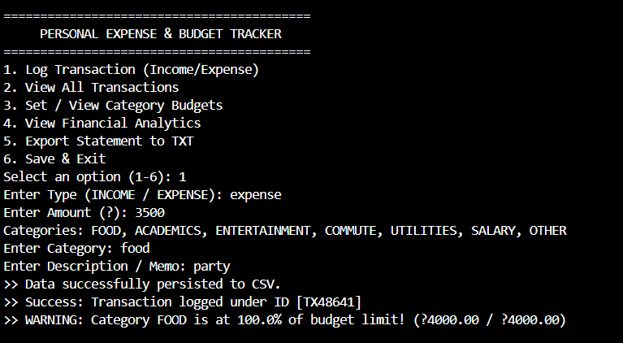
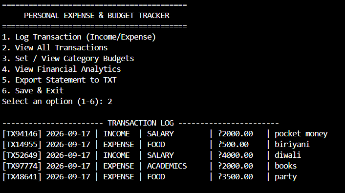
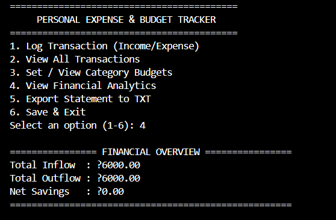
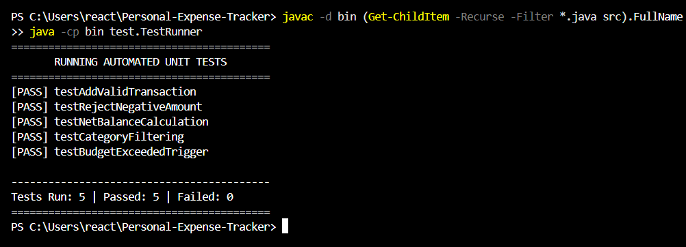

# Personal Expense & Budget Tracker


A terminal-driven, modular personal financial management tool written in Core Java. The system enables users to record income and expenses, enforce category budgets, receive proactive threshold alerts, persist records via flat-file CSV, and export formatted financial summary statements.

---

## 1. Project Overview
Managing daily variable expenditures is a major challenge for university students and independent professionals. The **Personal Expense & Budget Tracker** provides an offline, terminal-based solution designed to prevent deficits through automated threshold alerts and persistent tracking.

Built strictly using Object-Oriented Programming (OOP) paradigms, the system decouples responsibilities across data models, file persistence repositories, business services, custom checked exceptions, and interactive command-line interfaces.

---

## 2. Features & System Capabilities

### 2.1 Functional Modules
* **Transaction Engine (CRUD)**: Log, display, and structure both Income and Expense transactions with date stamps, custom memos, and category classifications (`FOOD`, `ACADEMICS`, `ENTERTAINMENT`, `COMMUTE`, `UTILITIES`, `SALARY`, `OTHER`).
* **Budget Threshold & Alert Engine**: Define monthly spending limits per category; triggers an immediate 80% soft warning and a critical hard alert upon a 100% budget breach.
* **Financial Analytics & Reporting**: Computes total inflow, total outflow, and net savings in real time, with the option to export formatted balance sheets directly to `data/summary_report.txt`.

### 2.2 Non-Functional Specifications
* **Reliability & Persistence**: Flat-file CSV storage (`data/transactions.csv`) ensures all records survive application restarts.
* **Robust Error Handling**: Employs custom checked exceptions (`InvalidTransactionException`, `BudgetExceededException`) and strict input parsing to prevent runtime crashes.
* **Maintainability & Modularity**: Layered package hierarchy isolating business rules from data storage and console presentation.
* **Resource Efficiency**: Utilizes Java standard collections (`ArrayList`, `HashMap`) for fast in-memory lookups and operations without redundant disk I/O.

---

## 3. Technologies & Tools Used
* **Programming Language**: Java (JDK 17 or higher)
* **Development Environment**: Visual Studio Code / Terminal CLI
* **Storage**: Flat-file CSV (Java I/O `BufferedReader`, `BufferedWriter`)
* **Version Control**: Git & GitHub[cite: 1]

---

## 4. Project Architecture & Directory Structure

```text
Personal-Expense-Tracker/
├── bin/                             # Compiled bytecode (.class files)
├── data/                            # Persistent data storage
│   ├── summary_report.txt           # Exported financial statements
│   └── transactions.csv             # Comma-separated transaction database
├── screenshots/    # Terminal run capture images
├── src/                             # Source code root
│   ├── exception/                   # Custom application exceptions
│   │   ├── BudgetExceededException.java
│   │   └── InvalidTransactionException.java
│   ├── model/                       # Data entities & Enums
│   │   ├── Budget.java
│   │   ├── Category.java
│   │   └── Transaction.java
│   ├── repository/                  # Flat-file I/O persistence layer
│   │   └── FileStorageRepository.java
│   ├── service/                     # Core business logic & analytics
│   │   ├── BudgetService.java
│   │   └── ExpenseService.java
│   ├── test/                        # Automated unit testing harness
│   │   └── TestRunner.java
│   └── ui/                          # Terminal user interface & entry point
│       ├── Main.java
│       └── MenuUI.java
├── .gitignore                       # Ignored build artifacts
├── README.md                        # Project documentation
└── statement.md                     # Academic problem statement & scope
```
---

## 5. Installation & Execution Instructions

* **Prerequisites:** Verify that a compatible JDK (version 17 or later) is installed and mapped to your system path.

```text
javac -version

java -version
```
### Step 1: Clone the Repository
```
git clone [https://github.com/yashm0809/Personal-Expense-Tracker.git](https://github.com/yashm0809/Personal-Expense-Tracker.git)
cd Personal-Expense-Tracker
```

### Step 2: Compile the Application
Compile all source files from the project root into the **bin** directory:
* **Windows (PowerShell):**
```
javac -d bin (Get-ChildItem -Recurse -Filter *.java src).FullName
```
* **Linux / macOS:**
```
javac -d bin $(find src -name "*.java")
```

### Step 3: Run the Application
Launch the terminal interface:
```
java -cp bin ui.Main
```
---

## 6. Testing & Validation
The project includes an automated test harness (**TestRunner.java**) to validate business calculations and boundary constraints without external testing framework dependencies.

### Execute the Test Suite
From the root directory, run:
```
java -cp bin test.TestRunner
```

### Automated Test Cases Included:
* **testAddValidTransaction:** Verifies accurate addition and retrieval of transactions from the active record set.
* **testRejectNegativeAmount:** Asserts that negative monetary values throw an **InvalidTransactionException**.
* **testNetBalanceCalculation:** Validates the calculation formula (**Net Savings = Inflow - Outflow**).
* **testCategoryFiltering:** Validates category-specific expense aggregation.
* **testBudgetExceededTrigger:** Confirms that spending beyond the set limit triggers a **BudgetExceededException**.
---

## 7. Execution Screenshots & Results

### 7.1 Main Menu Interface
The terminal welcomes the user with a structured options dashboard:


### 7.2 Transaction Logging & Real-Time Budget Alert
Demonstrating real-time threshold detection when an expense pushes category spending past the 80% warning limit:


### 7.3 Transaction Log History
Tabular view showing recorded income and expense entries loaded dynamically from persistent CSV storage:


### 7.4 Financial Analytics Overview
Summary calculation displaying real-time financial inflow, outflow, and net balance:


### 7.5 Automated Unit Test Results
Execution output demonstrating all 5 unit test cases passing via **test.TestRunner**:

